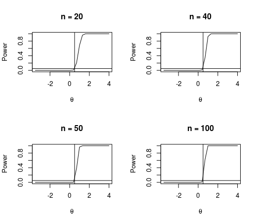
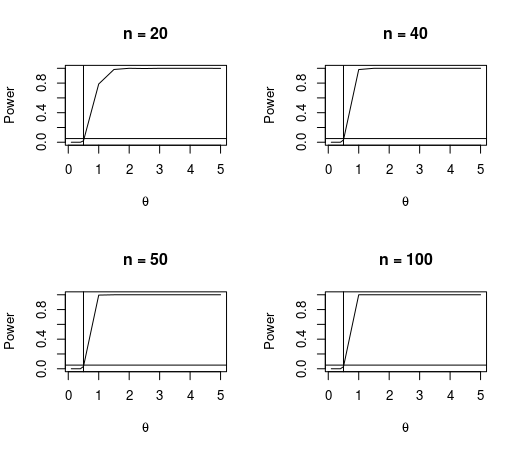
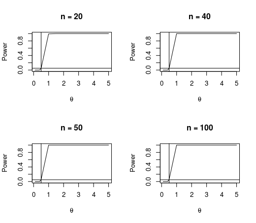
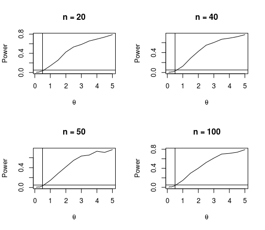

# Power-Nonparametrics
In statistical inference, we develop hypothesis testing over a distribution by using a test statistic.  
With the aim to compare the performance of the test statistic T in the following hypotheses , we generate data from 4 different distributions :

  - Normal(0.5,1);
  
  - Exponential(2);
  
  - Uniform(0,1);
  
  - Cauchy(0.5,1).
 
 To measure the performance, we shall use the power function and the significance level equal to 0.05.  
 We can see that the power increases as the size n increases for the Normal distribution. In the case of the Exponential distribution we have the same scenario but we do not see difference between size n = 50 and n = 100 which implies that for a sampling size equal to n = 50 we would have a satisfactory performance in relation to the power of the test. For the Uniform distribution such performance is totally independent of the size n, only in size n = 20 we have a little lower performance than the others sizes. The Cauchy distribution has a particularity 'cause its mean is defined but does not exist. Then, we can see that the among distributions, the Cauchy distribution has the lowest power functions and it seems do not depend on the size n.
 
 ## Normal
 
 
 ## Exponential
 
 
 ## Uniform
 
 
 ## Cauchy
 
 
